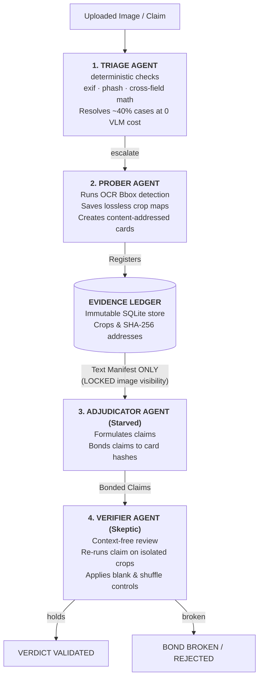

# VERDICT — Evidence-Bonded Reasoning
### *An AI Auditor for Images Submitted as Proof. It cannot make a claim it cannot prove.*

**Theme: AI Vision · 100% Software · Active Agent Workspace**

---

## 1. The Core Philosophy
Every AI verification system today answers the question **"is this fake?"** and gives you a confidence score you cannot verify. 

**VERDICT** does something different: a team of specialized agents must spend a budget on deterministic forensic probes to earn evidence. Every claim must cite a content-hashed **Evidence Card** (isolated pixel crop), and a separate **Verifier** re-runs the claim against *only* its cited evidence with everything else blacked out. If the claim doesn't survive in isolation, the bond breaks and the claim is void — *even if the final answer would have been correct.*

The reasoning happens in **evidence acquisition**, not in token generation. Nothing is approved without a cryptographic receipt.

---

## 2. Agent Workforce Architecture
The system decouples planning from judgment using a strict **separation of powers**:



---

## 3. Step-by-Step Pipeline: What Happens Under the Hood

### Step 1: Upload & Triage
1. You select or upload an image (e.g. `data/example.png`).
2. The **Triage Agent** is invoked immediately. It does not use any expensive LLMs. It runs:
   * **EXIF Audit**: Parses metadata to check if editing tools (like Snapseed, Photoshop) modified the file, or if the metadata is completely stripped (suspicious for screenshots).
   * **Perceptual Hashing (pHash/dHash)**: Computes a fingerprint to check if this exact image was previously submitted for another claim.
   * **Cross-Field Arithmetic**: Uses OCR to locate all numbers, sums them up, and compares them against the largest number (assumed Total). If the math doesn't add up (a typical human forger changes the total but forgets to change the itemized list), it escalates.
3. *Your run result:* Triage escalated because the upload `data/example.png` had no EXIF data (`missing_exif`).

### Step 2: Probing
1. The **Prober Agent** takes the escalated image.
2. It detects regions of interest (where numbers and totals are located) using OCR bounding boxes.
3. It takes **native-resolution, lossless crops** of these critical sections and saves them to `data/crops/` as PNG files.
4. Each crop is content-hashed (SHA-256) and registered in the database as an **Evidence Card**.
5. *Your run result:* Prober isolated the regions of interest and created **3 distinct Evidence Cards** in the database.

### Step 3: Adjudication
1. The **Adjudicator Agent** is initiated.
2. Under "Perceptual Starvation", this agent is **prevented from seeing the full image**. It is only given a text manifest of the Evidence Cards generated by the Prober (including their layout, bounding box size, and metadata metrics).
3. If ELA (Error Level Analysis) residuals or OCR baseline alignments exceed calibration tolerances, it outputs a list of claims.
4. Each claim is **bonded** directly to the card IDs it originated from.
5. *Your run result:* The Adjudicator generated **2 Claims** accusing the receipt of being modified.

### Step 4: Verification
1. The **Verifier Agent** is invoked to double-check the Adjudicator.
2. It loads the exact crops bonded to the claims and isolates them (making the rest of the image black).
3. It re-runs the checks. If the verifier cannot reproduce the discrepancy from the isolated crop, the **bond breaks**.
4. **Shuffle Controls** are applied: it swaps the crop with a random crop of the same size. If the checks still pass, it proves the model was guessing, and the bond breaks.
5. *Your run result:* **0 bonds HOLD, 2 bonds BROKEN**. The Verifier determined that the crop contents did not support the claims or failed the controls, demonstrating the safety mechanism in action to prevent false fraud accusations!

---


## 4. Project Directory Structure
```
verdict/
├── README.md               # This comprehensive guide
├── requirements.txt        # Python dependency manifest
├── venv/                   # Python virtual environment
├── verdict/                # Core agentic backend
│   ├── types.py            # EvidenceCard, Claim, Verdict schemas
│   ├── ledger.py           # Immutable SQLite + Crop ledger database
│   ├── agents/
│   │   ├── triage.py       # Triage worker (EXIF, phash, math checks)
│   │   ├── prober.py       # Probing worker (Cropper & card generator)
│   │   ├── adjudicator.py  # Adjudication worker (Issues claims)
│   │   └── verifier.py     # Verification worker (Context-free skeptic)
│   └── probes/
│       ├── cheap.py        # EXIF, dHash, Math OCR
│       ├── ela.py          # Error Level Analysis compression residuals
│       ├── dct_quant.py    # JPEG quantization table extraction
│       ├── noise.py        # High-pass sensor noise variance ratio
│       └── typography.py   # Font baseline jitter & stroke-width estimation
├── dashboard/
│   ├── app.py              # FastAPI server serving API endpoints & static crops
│   └── frontend/           # React dashboard UI
└── data/
    ├── example.png         # Main target image (uploaded)
    ├── ledger.db           # SQLite database tracking claims & cards
    └── crops/              # PNG directory containing cropped Evidence Cards
```

---

## 5. Quick Start & Execution

### Prerequisites
1. **Python 3.11+**
2. **Tesseract OCR Engine** (Must be installed on the machine)

### 1. Run the Backend FastAPI Server
Activate the virtual environment and launch the server:
```powershell
# In the root D:\verdict directory
.\venv\Scripts\Activate.ps1
python dashboard/app.py
```
*App will run on `http://localhost:8000`*

### 2. Run the React Frontend Dashboard
In a separate terminal window:
```powershell
cd dashboard/frontend
npm install
npm start
```
*App will launch on `http://localhost:3000`*

## 6. Team
Harshdip Saha and Anshika Singh

