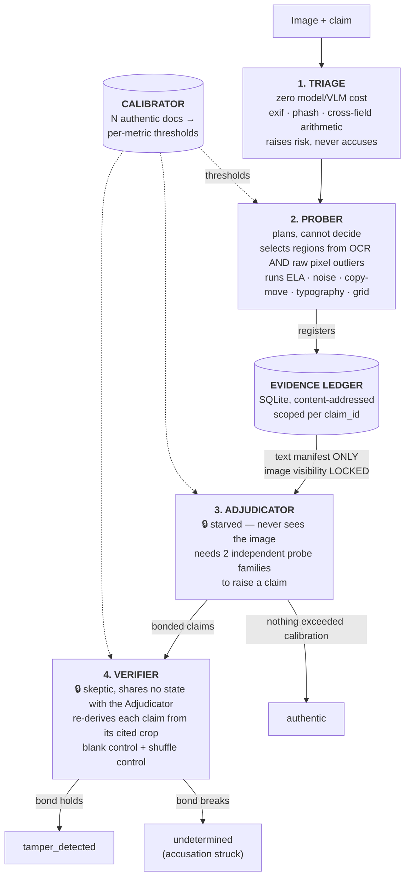

# VERDICT — Evidence-Bonded Reasoning

**Status:** WINNER OF THE HACKATHON AI ARENA -TOP 50✨

### An AI auditor for images submitted as proof. It cannot make a claim it cannot prove.

> **Status: rebuilt after a critical bug.** The pipeline as first shipped
> called every image tampered — authentic receipts included — with a
> measured **100% false-positive rate**. This branch is a full diagnosis and
> rebuild of the forensic core. See [What was broken](#what-was-broken-and-why)
> and [docs/PLAN.md §13](docs/PLAN.md) for the numbers behind that claim, and
> the [open issue](../../issues) for what's still unfinished.

---

## 1. The idea, in one paragraph

Every AI document-fraud detector answers *"is this fake?"* with a confidence
score you cannot check. VERDICT answers differently: a team of agents must
**spend a budget on deterministic forensic probes to earn evidence**, every
claim must **cite** the exact pixels it came from (content-hashed), and a
separate **Verifier** re-derives each claim from *only* its cited evidence —
with everything else blacked out — before the claim counts. If the claim
doesn't survive in isolation, the bond breaks and the claim is struck, **even
if it happened to be right**. Full rationale, worked examples, and prior-art
comparison: [`docs/idea.md`](docs/idea.md).

## 2. Why this is a different shape of system, not just a bigger model

Three architectural choices carry the whole design. Each answers a specific,
named failure mode of ordinary VLM-based fraud detection — see
[`docs/idea.md` §3](docs/idea.md) for the full argument.

| Mechanism | What it does | Failure mode it closes |
|---|---|---|
| **Perceptual starvation** | The Adjudicator (the agent with answer authority) never receives the image — not downsampled, not once. It reasons only over a text manifest of evidence cards the Prober had to spend budget to acquire. | *Lazy perception*: a model that can succeed without looking never learns to look. |
| **Evidence bonds** | Every claim cites the SHA-256 of the exact crop it came from. A second, independent agent re-derives the claim from *only* the cited crop, then swaps it for a random same-size region (**shuffle control**) — if the finding survives, it wasn't using its evidence. | *Right answer, wrong evidence* — and lazy perception a second time, caught adversarially. |
| **N=10 self-calibration** | Every threshold is measured from documents *this deployment* certifies as authentic, never shipped as a constant. | A fixed threshold tuned on someone else's dataset does not transfer — this is the exact mechanism whose absence caused the bug this branch fixes. |

The probes themselves — ELA, JPEG quantization tables, noise residuals,
copy-move, typography — are decades-old, well-understood forensics. **The
novelty claimed here is the architecture around them** (starvation, bonds,
calibration), not the probes. See [`docs/idea.md` §15](docs/idea.md) for the
prior-art comparison this project holds itself to.

## 3. Architecture



**Separation of powers** — this is the whole security model, not a nicety:
- Triage can raise risk, but spends nothing and decides nothing.
- The Prober plans and spends a budget, but has no authority to decide.
- The Adjudicator decides, but never sees a pixel — only what the Prober paid to describe.
- The Verifier validates, but shares no context with the Adjudicator and can strike its claims.

No single agent can produce a claim, its justification, *and* its validation.

## 4. Repository layout

```
verdict/
├── README.md                    this file
├── requirements.txt
├── docs/
│   ├── idea.md                  full concept, findings, worked examples, prior art
│   ├── PLAN.md                  the original build plan this rebuild follows
│   ├── RUN_GUIDE.md             narrated walkthrough of one pipeline run
│   ├── ARCHITECTURE.md          detailed HLD/LLD: data flow, schemas, bond protocol
│   └── test-images/             curated authentic + forged samples, see its README
├── aidlc-docs/
│   └── efforts/001-fix-false-positive-pipeline/   AI-DLC record of this session
│       ├── effort-state.md
│       ├── requirements-delta.md
│       └── root-cause-analysis.md
├── tools/
│   ├── make_corpus.py           generates labelled forgeries from real receipts
│   ├── probe_separation.py      PLAN.md §3 acceptance gate (probe AUC on forged vs authentic)
│   └── evaluate.py              end-to-end pipeline evaluation (F1, false-accusation rate, bond metrics)
├── verdict/
│   ├── types.py                 EvidenceCard, Claim, Verdict
│   ├── ledger.py                claim-scoped, content-addressed SQLite store
│   ├── calibrate.py             Mechanism 3 — per-deployment thresholds, no shipped constants
│   ├── orchestrator.py          wires the four agents, enforces separation of powers
│   ├── agents/
│   │   ├── triage.py            free probes only; raises risk, never accuses
│   │   ├── prober.py            selects regions, runs the forensic suite, spends budget
│   │   ├── adjudicator.py       🔒 starved — text manifest only
│   │   └── verifier.py          🔒 independent re-derivation + blank/shuffle controls
│   └── probes/
│       ├── ocr.py               shared OCR layer: amount parsing, row grouping, text regions
│       ├── cheap.py             EXIF audit, perceptual hash, cross-field arithmetic
│       ├── compression.py       multi-scale ELA, JPEG ghost, quantization tables, block-grid
│       ├── noise.py             high-pass residual, smoothness/flatness (anti-fill, anti-diffusion)
│       ├── typography.py        row-relative stroke width and baseline offset
│       ├── copymove.py          ORB self-matching + targeted template-match duplication score
│       └── geometric.py         native-resolution zoom, region isolation, shuffle sampling
├── dashboard/                    FastAPI + React demo UI (staged pipeline visualisation)
└── data/                         runtime output: ledger.db, crops/ (gitignored)
```

## 5. Quick start

```powershell
python -m venv venv
.\venv\Scripts\Activate.ps1
pip install -r requirements.txt
# Tesseract OCR must be installed separately: https://github.com/tesseract-ocr/tesseract

# Analyse one image with the calibration profile shipped for the demo corpus
python -m verdict.orchestrator docs/test-images/forged/002__retype_amount.jpg --customer sroie

# Or the full staged dashboard
python dashboard/app.py                 # backend on :8000
cd dashboard/frontend && npm install && npm start   # frontend on :3000
```

VERDICT ships with **no default thresholds** — that's Mechanism 3, not an
oversight. To run on your own documents, calibrate first:

```powershell
python -m verdict.calibrate path\to\authentic_documents --customer my-deployment
python -m verdict.orchestrator path\to\image.jpg --customer my-deployment
```

## 6. What was broken, and why

This branch started from a bug report: *"it says false [tampered] to even
correct [authentic] ones."* Reproducing it against 13 real, unmodified
receipts and camera photos confirmed **13/13 → `tamper_detected`**, plus a
crash on any real camera photo. Root causes, all fixed in this branch:

1. **No calibration layer existed.** Thresholds were literals — `abs(delta) > 0.5`, `z > 3.0` — never measured against anything. Calibrating on 12 real authentic receipts shows the worst-scoring region on an honest document routinely reaches an ELA z-score of 15–20 (a receipt has 50–100 text regions, and the maximum of that many draws is naturally large); the shipped `z > 3.0` was far inside the noise floor of an honest document, not past it.
2. **The arithmetic check accused every receipt.** It took the largest number anywhere on the page as "the total" and subtracted every other number — dates, phone numbers, quantities included — then flagged any non-zero remainder. It now requires a line whose *label* says total and refuses to answer (`insufficient_structure`) rather than guess.
3. **Evidence leaked across images.** The ledger cache was one process-global dict keyed only by card id, never by claim. Analysing image #10 in a batch adjudicated over images #1–#9's evidence too — a photo of a mountain in the reproduction run inherited 12 tamper claims from other people's receipts.
4. **The forensic probes were never called.** `ela.py`, `noise.py`, `dct_quant.py`, `typography.py` existed but nothing in `prober.py` invoked them — the Adjudicator's ELA branch was dead code. The system issued verdicts with no forensic evidence behind them.
5. **`piexif` bytes crashed `json.dumps`.** Any real camera photo (as opposed to a PNG screenshot) crashed the pipeline outright before a verdict was ever produced.
6. **The Verifier's bond tests could not fail.** The perceptual-hash check compared a dHash against a SHA-256 prefix and then wrote `or True`; the EXIF check's pass condition was inverted; the cross-field check only asked "does this crop contain any digit." Bonds held and broke for reasons unrelated to the claims they were meant to test.

Full root-cause writeup with line-level references:
[`aidlc-docs/efforts/001-fix-false-positive-pipeline/root-cause-analysis.md`](aidlc-docs/efforts/001-fix-false-positive-pipeline/root-cause-analysis.md).

## 7. Current status, measured

Full-corpus evaluation (134 images: 29 authentic + 105 forged across 5 modes;
calibration and evaluation sources disjoint — method and per-mode tables in
[`aidlc-docs/efforts/002-recall-tuning-two-tier-calibration/eval-results.md`](aidlc-docs/efforts/002-recall-tuning-two-tier-calibration/eval-results.md)):

| Metric | Value |
|---|---|
| False-accusation rate | **3.4%** (1/29 authentic) — was 100% before effort 001 |
| Precision | **0.947** |
| Recall, overall | **17.1%** (18/105) — was 0% at the effort-001 calibration |
| Recall, `retype_amount` (the dominant real-world fraud) | **52.4%** |
| Bonded-F1 | 0.29 — every detection carries an independently verified evidence bond |

Honest limitations, in order of importance:

- **Pixel-conservative forgery modes are mostly out of reach** of these
  probes at this calibration: a single spliced digit (4.8% recall), an
  in-place re-compression (9.5%), an erasure that doesn't break the
  arithmetic (9.5%). The per-mode numbers are printed, not averaged away.
- **A dead-grain erase detector was built, measured, and deliberately
  unwired**: on already-JPEG-compressed scans, compression itself produces
  natural grain-dead patches that bracket a real erase fill, firing
  identically on forged and authentic originals. Negative result recorded in
  `verdict/probes/noise.py::dead_grain_regions` and the effort-002 docs.
- **The residual false-positive class is large-font digit-run text** (receipt
  numbers printed as headers) — one such region accounts for the single
  false accusation.
- **The VLM/adjudication-language layer in `docs/PLAN.md` §5 is not
  implemented.** The Adjudicator reasons over calibrated statistics directly
  (no LLM call) — a cheaper, fully deterministic MVP of Mechanism 1; the
  natural-language claim generation described in the plan is future work.

## 8. Team

Harshdip Saha and Anshika Singh
