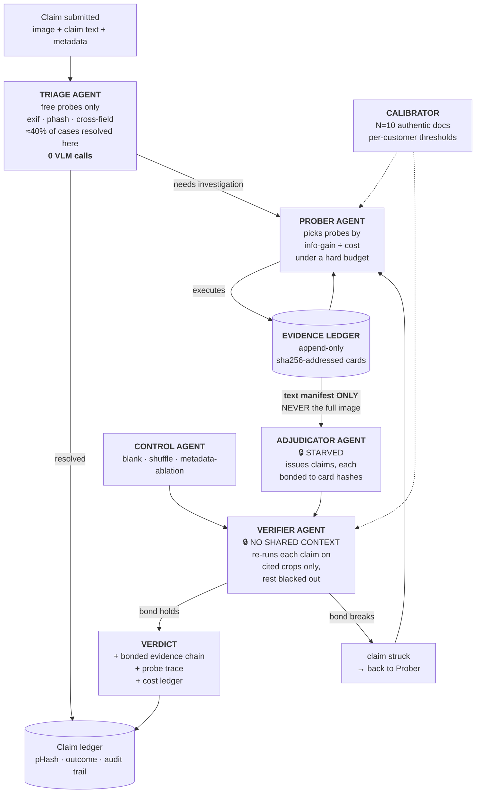

# VERDICT — Evidence-Bonded Reasoning

### An AI auditor for images submitted as *proof*. It cannot make a claim it cannot prove.

**AI Arena 3.0 · Theme: AI Vision · 100% software · No hardware**

---

## Table of contents

1. [The one-line pitch](#1-the-one-line-pitch)
2. [The problem, told as three stories](#2-the-problem-told-as-three-stories)
3. [Six findings that break every existing system](#3-six-findings-that-break-every-existing-system)
4. [The core insight: reasoning must *earn* evidence](#4-the-core-insight-reasoning-must-earn-evidence)
5. [The three mechanisms](#5-the-three-mechanisms)
6. [The probe action space](#6-the-probe-action-space)
7. [The system: an agent workforce](#7-the-system-an-agent-workforce)
8. [Worked example 1: the ₹4,000 → ₹40,000 receipt](#8-worked-example-1-the-4000--40000-receipt)
9. [Worked example 2: a bond breaks — right answer, wrong evidence](#9-worked-example-2-a-bond-breaks--right-answer-wrong-evidence)
10. [Worked example 3: killing a false accusation](#10-worked-example-3-killing-a-false-accusation)
11. [Worked example 4: AI-generated refund fraud](#11-worked-example-4-ai-generated-refund-fraud)
12. [Worked example 5: onboarding a new customer in 10 documents](#12-worked-example-5-onboarding-a-new-customer-in-10-documents)
13. [Worked example 6: the claim that was true but unprovable](#13-worked-example-6-the-claim-that-was-true-but-unprovable)
14. [The cost argument, with numbers](#14-the-cost-argument-with-numbers)
15. [Why this is novel — prior art comparison](#15-why-this-is-novel--prior-art-comparison)
16. [Where this gets deployed](#16-where-this-gets-deployed)
17. [What success looks like](#17-what-success-looks-like)
18. [Honest limitations](#18-honest-limitations)
19. [Glossary](#19-glossary)
20. [References](#20-references)

---

## 1. The one-line pitch

> Every AI verification system today answers the question **"is this fake?"** and gives you a number you cannot check.
> VERDICT answers **"prove it,"** and is architecturally incapable of producing a claim that isn't backed by a specific, hashed, re-verifiable piece of pixel evidence.

An image is submitted as **proof of a claim** — a receipt supporting a reimbursement, a photo supporting a refund, an invoice supporting a loan, a damage photo supporting an insurance payout.

A normal VLM looks at a 448×448 thumbnail of that image and confidently declares a verdict. VERDICT does something different: a team of agents must **spend a budget on forensic probes** to earn evidence, every claim must **cite a content-hashed evidence card**, and a separate Verifier **re-runs each claim against only its cited evidence with everything else blacked out.** If the claim doesn't survive in isolation, the bond breaks and the claim is void — *even if the final answer would have been correct.*

The reasoning happens in **evidence acquisition**, not in token generation. And nothing ships without a receipt.

---

## 2. The problem, told as three stories

### Story A — The ₹4,000 dinner that became ₹40,000

An employee submits a restaurant receipt for reimbursement. The bill was ₹4,000. He opens a free AI image editor, types *"change 4,000 to 40,000"*, and one second and a few cents later has a receipt that is, pixel for pixel, indistinguishable from the original.

The finance team's AI checker — a frontier VLM — reads the receipt, sees ₹40,000, sees a plausible restaurant logo, sees a plausible GST number, and approves.

This is not hypothetical. A 2026 study put **120 human inspectors** in front of exactly these forgeries, side by side with authentic originals. Their accuracy was **0.501 — a coin flip**. GPT-Image-2 asked to judge its *own* forgeries scored **0.532**. The best dedicated forensic detector scored **0.599**.

Everyone is blind. Including the machines.

### Story B — The detector that was right for the wrong reason

An insurance company deploys an "explainable" AI claim checker. For a suspicious claim it outputs:

> *"FRAUD DETECTED (confidence 0.91). The dent on the rear door shows inconsistent shadow direction relative to the ambient lighting, indicating compositing."*

Beautiful. Auditable. Actionable.

It is also **nonsense**. The model never resolved the dent — at the resolution it saw, the dent was 11 pixels. It flagged the claim because the *filename* pattern matched previously-fraudulent submissions, and then it **generated a plausible-sounding visual justification after the fact.**

The answer happened to be right. The evidence was fabricated. Nobody could tell, because nobody checked whether the stated evidence actually supported the stated conclusion.

The 2026 literature has a name for this: **wrong-evidence-right-answer**. It is one of six documented *silent failure* modes, and the papers are blunt — surface accuracy **consistently overestimates** true trajectory-level correctness.

### Story C — The model that only pretended to look

A team builds an agentic verifier. It has a `zoom(region)` tool. Watching the traces, it looks perfect: the agent zooms into the total, zooms into the date, zooms into the signature, then answers.

Then someone runs the ablation: **they feed the agent garbage crops instead of the real ones.**

The answers barely change.

The agent had learned to **emit the surface form of zooming without functionally depending on what came back**. The 2026 paper that named this — *lazy perception* — states the underlying law with brutal clarity:

> **"If a model can succeed without actively looking, it will never learn to look."**

Three stories. Three different failures. One root cause: **nothing in the architecture forces evidence to matter.**

---

## 3. Six findings that break every existing system

These are not opinions. Each is a 2026 published result.

### Finding 1 — Lazy perception: models fake looking

> *Starve to Perceive: Taming Lazy Perception in VLMs with Constrained Visual Bandwidth* — [arXiv 2605.18603](https://arxiv.org/abs/2605.18603)

VLMs given zoom/crop/pan tools "mimic the surface form of such operations **without functionally depending on their outputs**." The cause is a learning asymmetry: when a coarse global view plus language priors is good enough for moderate accuracy, there is no incentive to look harder.

Their fix — **constrain visual bandwidth so that no single view suffices** — is a *training* paradigm. **VERDICT applies the same principle as an inference-time architecture, training-free.** That is the gap.

### Finding 2 — Evidence misalignment: right answer, wrong evidence

> *VideoSEAL: Mitigating Evidence Misalignment in Agentic Understanding* (ICML 2026) — [arXiv 2605.12571](https://arxiv.org/abs/2605.12571)

Agents "produce correct answers that are **not supported by the retrieved or inspected evidence**." Two pressures amplify it: **prompt pressure** (shared-context saturation at inference) and **reward pressure** (outcome-only optimisation during training). The structural root cause they identify: *coupling long-horizon planning with answer authority*.

### Finding 3 — A taxonomy of silent failures

> *Silent Failures in Multimodal Agentic Search* (SIGIR 2026) — [arXiv 2607.19793](https://arxiv.org/abs/2607.19793)

Six categories: modality shortcuts, phantom grounding, **wrong-evidence-right-answer**, over-retrieval laundering, cross-modal contradiction, provenance hallucination. Conclusion: *"surface accuracy consistently overestimates true trajectory-level correctness"* — and silent failures **shift rather than disappear** as models get stronger.

Corroborated independently by *MedFlowBench* ([arXiv 2603.24649](https://arxiv.org/abs/2603.24649)): *"final answer-only scoring gives an overly optimistic picture: when answers must also be supported by correct evidence, performance drops substantially."*

### Finding 4 — AI forgery has already broken every defence

> *When the Forger Is the Judge: GPT-Image-2 Cannot Recognize Its Own Faked Documents* — [arXiv 2604.25213](https://arxiv.org/abs/2604.25213)

> *"A single number on a receipt can be replaced in under a second for a few cents."*

Four lines of defence, measured:

| Judge | Accuracy / AUC |
|---|---|
| **120 human inspectors** (N=365 pair-votes, side-by-side) | **0.501 — chance** |
| TruFor (generic forensic SOTA) | 0.599 |
| DocTamper (document-specific SOTA) | 0.585 |
| GPT-Image-2 judging its own forgeries | 0.532 |

Both forensic detectors retain near-published performance on *traditional* tampering (TruFor 0.962, DocTamper 0.852) — switching to AI inpainting drops AUC by **0.27–0.36**. This is a detection gap **specific to generative editing**.

Confirmed by *AIForge-Doc* ([arXiv 2602.20569](https://arxiv.org/abs/2602.20569)): GPT-4o zero-shot judge **AUC 0.509 — chance**; DocTamper 0.563 with pixel IoU **0.020**.

### Finding 5 — It's a calibration failure, and 10 images fix half of it

> *DOCFORGE-BENCH* — [arXiv 2603.01433](https://arxiv.org/abs/2603.01433)

The single most actionable finding in this entire space:

- Methods reach Pixel-AUC ≥ 0.76 but **near-zero Pixel-F1**.
- Cause: tampered regions occupy only **0.27–4.17%** of pixels — an order of magnitude less than in natural-image benchmarks — making the standard τ=0.5 threshold *"catastrophically miscalibrated."*
- **Oracle-F1 is 2–10× higher** than fixed-threshold F1. So the representation is fine; **the threshold is the bottleneck.**
- **Adapting a single threshold on N=10 domain images recovers 39–55% of the gap.**
- And: *"all eight datasets predate the era of generative AI editing."*

> **Translation: you must not ship a threshold. You must calibrate on the customer's own documents. Ten of them is enough to recover half the loss.**

Reinforced by *DocQT* ([arXiv 2605.19688](https://arxiv.org/abs/2605.19688)): the mismatch between training-time JPEG quantization tables and **real insurance pipelines** is a major hidden cause of failure — and only architectures that explicitly ingest the quantization table benefit from fixing it.

### Finding 6 — Confidence is not visibility

> *Detector Confidence Signals Presence Rather Than Occlusion* — [arXiv 2607.13361](https://arxiv.org/abs/2607.13361)

As true visibility falls to **one eighth**, detector confidence stays *nearly constant* and uncorrelated — and can even **rise** with clutter. The damning line: *"a confidence-based gate fires exactly when the object is hidden."*

So we never gate on confidence. We gate on **measured pixels-on-target**.

---

### The six findings, and what they force

| Finding | Forces this design decision |
|---|---|
| Lazy perception | The decider must be **starved** — it can never see the full image |
| Evidence misalignment | Claims must be **bonded** to hashed evidence and re-verified in isolation |
| Silent failures | Trajectory-level auditing, blank-controls, provenance checks |
| AI forgery beats everyone | Must combine **many weak, orthogonal** signals — no single detector works |
| Calibration is the bottleneck | Ship **no threshold**; self-calibrate on N=10 customer documents |
| Confidence ≠ visibility | Gate on **pixels-on-target**, never on model confidence |

VERDICT is what you get if you take all six seriously at once. Nobody has.

---

## 4. The core insight: reasoning must *earn* evidence

### The resolution catastrophe nobody talks about

Here is the number that makes this whole project make sense.

A phone photo of a receipt is **4000 × 3000 px**. A VLM ingests **448 × 448**.

$$\text{linear reduction} = \frac{4000}{448} \approx 8.9\times \qquad \text{area reduction} \approx 79\times$$

The forged digit occupies **0.27–4.17%** of the image. At 1% of a 4000×3000 image that's a region roughly **400 × 300 px**. After downsampling it is **45 × 34 px** — and the *stroke* detail that betrays the forgery, maybe 3 px wide originally, is now **sub-pixel**.

> **The evidence is destroyed by `resize()` before the model ever sees it.**
>
> This is not a model capability problem. It is an **information** problem. No amount of reasoning recovers pixels that were thrown away at the door.

### The standard "chain of thought"

The model is unsure, so it **generates more text**:

```
Let me examine this receipt carefully. The total appears to read ₹40,000.
The font of this number seems consistent with the surrounding text, though
I note the spacing between characters could indicate... [340 more tokens]
```

Every token is a memory-bound decode step. Every token costs money. And **not one of them adds information** — the model is re-arranging the same 45×34 blur.

### The VERDICT alternative: Probe Chain-of-Custody

The model is unsure, so it **spends budget to acquire evidence that did not previously exist in its context**:

```
step 0   claim under test   "total field reads ₹40,000 and is authentic"
         pixels on target   34 px height          → CANNOT RESOLVE
         PROBE              zoom(bbox=[2210,1180,2560,1290], native)
         cost               1 probe unit
         result             1,540 px height  (45× more pixels)

step 1   PROBE              ela(quality=[70,80,90])
         result             total field residual 4.1σ above document mean

step 2   PROBE              dct_quant_table()
         result             single-compression signature in a doc that is
                            otherwise double-compressed  ← inpainting artifact

step 3   PROBE              cross_field_arithmetic()
         result             line items sum to ₹4,000, stated total ₹40,000
                            ← the forger edited one number, not the maths

VERDICT  tamper_detected · 4 independent bonded evidence cards · 61 output tokens
```

Four probes. Four **orthogonal** signals. Sixty-one tokens.

### Why probes beat tokens

| | Text CoT | Probe CoT |
|---|---|---|
| Unit of reasoning | 1 output token | 1 forensic probe |
| Cost per unit | ~$0.000015 | ~$0.0002 (10 tokens' worth) |
| Units to resolve | ~350 tokens | ~4 probes |
| Total cost | ~$0.005 | ~$0.0008 |
| **New information gained** | **zero** | **45× pixels + 3 orthogonal physical signals** |

A probe costs about what 10 output tokens cost — and it is the only one of the two that **buys evidence**.

> **The slogan:** *Don't reason harder. Look closer, and prove you looked.*

---

## 5. The three mechanisms

Three architectural devices, each answering one finding. All training-free.

### Mechanism 1 — **Perceptual Starvation**
> *Answers Finding 1 (lazy perception)*

The **Adjudicator** — the agent that issues the final verdict — **never sees the full document image.** Not once. Not downsampled. Never.

It receives only a text manifest of **evidence cards** that the Prober had to spend budget to acquire:

```json
{"card": "EV-3", "probe": "zoom", "bbox": [2210,1180,2560,1290],
 "px_on_target": 1540, "sha256": "9f2a...c41e",
 "observation": "digit '4' stroke terminals lack the ink-bleed present in all
                 other glyphs on this line", "cited_by": ["C-1","C-4"]}
```

*Starve to Perceive* proved that if a coarse global view suffices, the model never learns to look. VERDICT removes the coarse global view **entirely, at inference time**. Active perception is not encouraged — it is **the only physically available strategy**.

This is the paper's insight moved from the training loop to the architecture. That relocation is the contribution.

### Mechanism 2 — **Evidence Bonds**
> *Answers Findings 2 & 3 (evidence misalignment, silent failures)*

Every claim carries a **bond**: a cryptographic commitment to the exact bytes it was derived from.

```
CLAIM   C-1  "the total field has been digitally altered"
BOND    ⟨ EV-3 : sha256 9f2a...c41e , EV-5 : sha256 71bd...0a93 ⟩
```

Then the **Verifier** — a *separate model instance with no shared context* — re-runs the claim against **only the cited crops, with every other pixel blacked out**, and must independently reach the same conclusion.

```
BOND TEST  C-1
  input     EV-3 ⊕ EV-5 only. Rest of document = solid black.
  question  "Does this evidence alone support: 'total field digitally altered'?"
  result    YES, independently reached
  → BOND HOLDS ✓
```

If the Verifier cannot reproduce the claim from the cited evidence alone, **the bond breaks and the claim is struck from the record** — even if it happened to be true.

> This is the mechanism nobody has. Everyone measures whether the *answer* was right. VERDICT makes **evidence-groundedness a hard gate at inference time**, not a metric computed afterwards. A lucky guess with a fabricated justification is *structurally rejected*.

**Anti-laundering controls**, each lifted from the silent-failures taxonomy:

| Control | Catches |
|---|---|
| **Blank control** — same prompt, solid grey crop | Prompt-induced hallucination |
| **Shuffle control** — cited crop swapped for a random crop of equal size | Lazy perception (if the claim survives, it never used the evidence) |
| **Metadata-ablation control** — filename, EXIF, OCR text stripped | Modality shortcuts |
| **Provenance check** — every card hash must exist in the ledger | Provenance hallucination |

The **shuffle control is the sharpest tool in the box.** If a claim survives having its evidence replaced with garbage, the model was never using it. That is lazy perception, caught red-handed, at inference time.

### Mechanism 3 — **N=10 Self-Calibration**
> *Answers Findings 5 & 6 (calibration, confidence)*

VERDICT **ships with no thresholds.** On deployment it ingests **10 documents the customer certifies as authentic** and learns *that pipeline's* baseline:

- **JPEG quantization table bank** — this scanner, this app, this compression history (per DocQT)
- **ELA residual distribution** — the noise floor of *these* documents
- **Font metric distribution** — baseline jitter, stroke width, kerning for *this* template
- **Noise-residual statistics** — the sensor / rendering fingerprint
- **Per-probe threshold** at a fixed target false-positive rate

Anomaly is then measured as a **z-score against this customer's own authentic corpus**, not against UCF-Crime or CASIA v2. DOCFORGE-BENCH measured that this exact move recovers **39–55%** of the Oracle-F1 gap.

And per Finding 6, gating uses **measured pixels-on-target**, never model confidence. If PoT < the probe's stated minimum, the system returns `insufficient_evidence` and **refuses to answer**.

> A system that knows when it cannot see is worth more than one that guesses. Refusal is a feature.

---

## 6. The probe action space

Each probe returns evidence that **did not exist in the context before**. This is the software equivalent of moving a lens — and every one is a well-understood, deterministic operation.

| Probe | Returns | Catches | Cost |
|---|---|---|---|
| `zoom(bbox)` | Native-resolution crop, **up to 45× more pixels** | Everything. The workhorse. | 1 |
| `ela(qualities)` | Multi-scale Error Level Analysis residual map | Splicing, resave boundaries | 1 |
| `dct_quant()` | JPEG quantization tables + double-compression map | AI inpainting (re-encode leaves a single-compression island) | 1 |
| `noise_residual()` | High-pass sensor-noise fingerprint | Diffusion regions suppress high-frequency variance | 2 |
| `font_metrics(bbox)` | Baseline offset, stroke width, kerning vs document mean | Text edits — generators rarely match kerning | 1 |
| `cross_field()` | Arithmetic / logical consistency across fields | The forger edits one number, not the maths | 0 |
| `enhance(mode)` | CLAHE / gamma / unsharp / channel isolation | Detail captured but not perceptible in default rendering | 1 |
| `copy_move()` | Block-matching self-similarity map | Cloned regions (a stamp duplicated, a dent copied) | 2 |
| `exif_audit()` | EXIF, software tags, timestamp coherence | Careless forgery; "Edited with…" tags | 0 |
| `perceptual_hash()` | pHash lookup against the claim ledger | **The same photo submitted for two different claims** | 0 |
| `blank_control()` | Same prompt on a grey image | Prompt hallucination | 1 |
| `shuffle_control()` | Same prompt on a random crop | **Lazy perception** | 1 |

Probe selection maximises **expected information gain per unit budget**:

$$\text{probe}^{*} = \arg\max_{p}\; \frac{\mathbb{E}\big[H(\text{claim}) - H(\text{claim}\mid o(p))\big]}{\text{cost}(p)}$$

Cheap deterministic probes (`cross_field`, `exif_audit`, `perceptual_hash`) cost **zero VLM calls** and run first — they frequently resolve a case outright before a single token is generated.

> **Honest note on novelty.** ELA, DCT analysis, copy-move and PRNU are *classical* forensics, decades old. **We claim no novelty in the probes.** The novelty is the architecture around them: starvation, bonds, and self-calibration. We use well-understood primitives precisely *because* they are deterministic, cheap, and auditable — which is what a bond requires.

---

## 7. The system: an agent workforce

AI Arena 3.0's brief calls for **teams of specialised agents that collaborate and hand off tasks**. VERDICT is exactly that — with a strict separation of powers, because that separation *is* the security model.



### The six agents

| Agent | Sees | Job |
|---|---|---|
| **Triage** | Metadata + cheap deterministic probes. **No VLM.** | Resolve the easy ~40% at zero model cost |
| **Prober** | Full image, but only to *choose* where to probe | Maximise information gain per budget unit |
| **Adjudicator** | 🔒 **Evidence cards only — never the image** | Issue bonded claims |
| **Verifier** | 🔒 **Only the cited crops, isolated** | Independently reproduce, or break the bond |
| **Control** | Adversarial variants | Blank / shuffle / metadata-ablation tests |
| **Calibrator** | 10 customer-certified authentic docs | Set every threshold, in-situ |

### The separation of powers — and why it is the whole design

VideoSEAL identified the structural root cause of evidence misalignment as **"coupling long-horizon planning with answer authority."** VERDICT decouples them completely:

- The **Prober** plans but **cannot decide**.
- The **Adjudicator** decides but **cannot see**.
- The **Verifier** validates but **cannot plan** and **shares no context**.

No single agent can produce a claim, its justification, *and* its validation. That is not a nicety — it is the reason a fabricated justification cannot survive the pipeline.

---

## 8. Worked example 1: the ₹4,000 → ₹40,000 receipt

**Submission.** Employee expense claim. `IMG_20260726_204133.jpg`, 4032 × 3024. Claimed amount **₹40,000**. Restaurant bill.

---

**t = 0.00 s — TRIAGE** *(0 VLM calls)*

```json
{"agent":"triage","probes":["exif_audit","perceptual_hash","cross_field"],
 "exif":       {"make":"Xiaomi","software":null,"dt_orig":"2026-07-26T20:41:33",
                "note":"clean — no editor tag"},
 "phash":      {"match":null,"note":"not previously submitted"},
 "cross_field":{"line_items_sum":4000.00,"stated_total":40000.00,
                "delta":36000.00,"status":"<b>ARITHMETIC MISMATCH</b>"},
 "decision":"ESCALATE","reason":"stated total ≠ sum of line items","vlm_calls":0}
```

Note what just happened. The single most damning signal — **the maths doesn't add up** — cost **zero model calls** and **zero tokens**. The forger changed one number; he did not recompute the bill.

A frontier VLM asked *"is this receipt fake?"* would have burned 400 tokens describing the restaurant's logo and never done the arithmetic.

---

**t = 0.02 s — PROBER, step 0**

```json
{"agent":"prober","step":0,"budget_remaining":8,
 "hypotheses":[
   {"h":"total_field_altered","prior":0.62,"region":"total_bbox","px_needed":800},
   {"h":"line_item_altered",  "prior":0.21,"region":"items_bbox","px_needed":600},
   {"h":"whole_doc_synthetic","prior":0.10,"region":"full",      "px_needed":400},
   {"h":"authentic_typo",     "prior":0.07,"region":"total_bbox","px_needed":800}],
 "entropy":1.19,
 "px_on_target_now":34,
 "probe":{"type":"zoom","bbox":[2210,1180,2560,1290],"native":true},
 "rationale":"total field at 34 px — CANNOT RESOLVE any hypothesis. zoom first.",
 "cost":1}
```

→ **EV-1**: `sha256 9f2ac41e…`, **1,540 px on target — a 45× gain.**

---

**t = 0.31 s — PROBER, step 1** *(ELA)*

```json
{"step":1,"probe":{"type":"ela","qualities":[70,80,90]},
 "result":{"doc_mean_residual":11.4,"doc_std":3.1,
           "total_bbox_residual":24.1,"z_score":<b>4.10</b>,
           "note":"residual elevated ONLY inside the total field"},
 "calibration":"z-threshold 3.2 (customer C-0041, n=10 authentic)","cost":1}
```

→ **EV-2**: `sha256 71bd0a93…`

Crucially, the threshold `3.2` was **not shipped**. It was learned from *this customer's own* ten authentic receipts. On a different customer's scanner it might be 2.7 or 4.4.

---

**t = 0.55 s — PROBER, step 2** *(quantization tables)*

```json
{"step":2,"probe":{"type":"dct_quant"},
 "result":{"qtable_luma_hash":"a41f…","matches_customer_bank":true,
           "double_compression_map":"present across 96.2% of blocks",
           "single_compression_island":{"bbox":[2214,1183,2558,1288],
                                        "iou_with_total_field":<b>0.94</b>}},
 "interpretation":"region re-encoded ONCE while the document was encoded TWICE
                   — signature of localized regeneration (inpainting)","cost":1}
```

→ **EV-3**: `sha256 c8e41770…`

This is the probe that specifically catches **AI inpainting** — the exact failure mode where TruFor drops to 0.599 and GPT-4o to 0.509.

---

**t = 0.78 s — PROBER, step 3** *(font metrics)*

```json
{"step":3,"probe":{"type":"font_metrics","bbox":"total_bbox"},
 "result":{"baseline_offset_px":2.7,"doc_baseline_jitter_px":0.4,
           "stroke_width_ratio":1.19,"doc_stroke_ratio":1.00,
           "kerning_zscore":3.8,
           "note":"digits '4','0','0','0' sit 2.7 px above the ruled baseline
                   that every other glyph on the receipt respects"},
 "cost":1}
```

→ **EV-4**: `sha256 2b90ff17…`

---

**t = 0.79 s — ADJUDICATOR** 🔒 *starved — has never seen the image*

Input is **text only**:

```
EVIDENCE MANIFEST — claim CLM-88213
EV-1  zoom        total_bbox @native   px_on_target=1540   sha 9f2ac41e
EV-2  ela         z=4.10 vs cal 3.2, localized to total_bbox   sha 71bd0a93
EV-3  dct_quant   single-compression island IoU 0.94 w/ total_bbox   sha c8e41770
EV-4  font        baseline +2.7px (jitter 0.4), kerning z=3.8   sha 2b90ff17
EV-0  cross_field items sum 4000.00, stated 40000.00   sha 004a1122
```

Output — grammar-constrained, **58 tokens**:

```json
{"verdict":"tamper_detected","confidence":0.94,
 "claims":[
  {"id":"C-1","text":"total field digitally altered","bond":["EV-2","EV-3","EV-4"]},
  {"id":"C-2","text":"stated total inconsistent with line items","bond":["EV-0"]},
  {"id":"C-3","text":"alteration localized to total field only","bond":["EV-3"]}],
 "recommended_action":"reject_and_flag"}
```

---

**t = 0.80 s — VERIFIER** 🔒 *fresh instance, no shared context*

```
BOND TEST C-1  — input: EV-2 ⊕ EV-3 ⊕ EV-4 crops only, rest solid black
   independently reached "region shows localized re-encoding + font mismatch"  ✓ HOLDS
BOND TEST C-2  — input: EV-0 numeric manifest only
   4000.00 ≠ 40000.00                                                          ✓ HOLDS
BOND TEST C-3  — input: EV-3 only
   single-compression island confined to one bbox                              ✓ HOLDS

CONTROLS
   blank      grey crop  → "insufficient_evidence"                             ✓ PASS
   shuffle    EV-2 replaced with random crop → verdict flips to "no_tamper"    ✓ PASS
              (claim DID depend on its evidence — not lazy perception)
   metadata   filename/EXIF/OCR stripped → verdict unchanged                   ✓ PASS
              (not a modality shortcut)
```

The **shuffle control passing** is the moment that distinguishes VERDICT from every system in Section 3. It is positive proof that the conclusion was *caused by* the evidence.

---

**t = 0.92 s — VERDICT**

```json
{"claim_id":"CLM-88213","verdict":"tamper_detected","confidence":0.94,
 "bonded_claims":3,"broken_bonds":0,
 "evidence_chain":["EV-0","EV-1","EV-2","EV-3","EV-4"],
 "controls":{"blank":"pass","shuffle":"pass","metadata_ablation":"pass"},
 "cost":{"vlm_calls":6,"output_tokens":141,"probes":5,"usd":0.0021},
 "latency_s":0.92,
 "audit_bundle":"CLM-88213.zip"}
```

**Total: 0.92 s. 141 output tokens. ₹0.18.** And every sentence in the report is re-checkable by a human against a hashed crop.

---

## 9. Worked example 2: a bond breaks — right answer, wrong evidence

This is the example that justifies the entire architecture.

**Submission.** Vehicle insurance claim. Photo of a car with a dented rear door. The claim **is** fraudulent — the dent was digitally composited.

**PROBER** runs 4 probes. **ADJUDICATOR** issues:

```json
{"verdict":"tamper_detected","confidence":0.88,
 "claims":[{"id":"C-1","text":"dent region shows shadow direction inconsistent
                              with ambient lighting","bond":["EV-2"]}]}
```

The **answer is correct.** The claim really is fraudulent. A normal system ships this, the reviewer reads a crisp explanation, everyone is happy.

**VERIFIER:**

```
BOND TEST C-1  — input: EV-2 crop only, rest black
   EV-2 is a NOISE-RESIDUAL MAP. It contains no shadow information whatsoever.
   Verifier cannot assess shadow direction from this evidence.
   → result: "insufficient_evidence"
   ✗ <b>BOND BROKEN</b>

DIAGNOSIS  wrong-evidence-right-answer
   The Adjudicator reached a correct conclusion from EV-2's anomalous residual,
   then generated a plausible-sounding SHADOW justification that EV-2 does not
   and cannot support. Classic confabulation.

ACTION  C-1 STRUCK. Verdict reverts to "undetermined". Returned to Prober.
```

**PROBER, round 2** — now explicitly tasked to acquire evidence for the *shadow* hypothesis:

```json
{"step":4,"probe":{"type":"enhance","mode":"gamma_lift+channel_isolate_b"},
 "rationale":"shadow geometry is unresolvable in the default rendering;
              lift shadows in the blue channel","cost":1}
```

→ **EV-5**. Re-adjudication:

```json
{"claims":[
  {"id":"C-1b","text":"dent boundary shows noise-residual discontinuity",
   "bond":["EV-2"]},
  {"id":"C-4","text":"cast shadow under the dent is absent while all other
                      body contours cast shadows","bond":["EV-5"]}]}
```

Both bonds now **HOLD**. Same final verdict — but now every word of it is true, and the reviewer can verify each claim against a specific crop in under ten seconds.

> ### Why this matters more than accuracy
>
> Both runs produce `tamper_detected`. **On any answer-accuracy benchmark they are identical.** Both score 1.0.
>
> But run 1 would be **destroyed in court, in an ombudsman review, or in a regulatory audit** — because its stated reason is fabricated and provably unsupported by the evidence it cites.
>
> Everyone in Section 3 is measuring run 1 and run 2 as the same thing. **They are not the same thing.** VERDICT is the only system that can tell them apart, and it does so *before* the report is issued rather than in a post-hoc benchmark.

---

## 10. Worked example 3: killing a false accusation

Accusing an honest customer of fraud is far more expensive than missing a fraud — in churn, in regulatory exposure, in reputation. This is the case that decides whether the product survives contact with a real business.

**Submission.** A genuine restaurant receipt. Slightly crumpled. Photographed at an angle under warm sodium lighting. The customer is honest.

```
TRIAGE   exif clean · phash no match · cross_field: items 2,340 = total 2,340  ✓
         decision: LOW RISK — but ELA screen requested by policy

PROBER   step 0  ela()
         → doc_mean 9.8, crumple_ridge_residual 27.2, z = 5.6   ⚠ ABOVE THRESHOLD

ADJUDICATOR (naive path)  → "tamper_detected, conf 0.71, region: centre-left"
```

**A conventional detector ships this and accuses an honest customer.** The crumple ridge produced a textbook ELA false positive.

**VERIFIER:**

```
BOND TEST C-1  — input: EV-2 (ELA map) crop only
   Verifier: "elevated residual present, but morphology is a CONTINUOUS LINEAR
              RIDGE spanning 340 px, crossing multiple text lines and the paper
              margin. Tampering is bounded and region-local; this is not."
   → result: "no_tamper"
   ✗ <b>BOND BROKEN — verifier disagrees with adjudicator</b>

DISAGREEMENT ESCALATION → mandatory corroboration required
```

**PROBER, round 2** — must corroborate with **orthogonal** evidence:

```json
{"step":1,"probe":{"type":"dct_quant"},
 "result":{"double_compression":"uniform across ALL blocks",
           "single_compression_islands":<b>"none"</b>}}

{"step":2,"probe":{"type":"font_metrics","bbox":"total_bbox"},
 "result":{"baseline_offset_px":0.3,"doc_jitter":0.4,"kerning_z":0.6,
           "verdict":"<b>consistent</b>"}}

{"step":3,"probe":{"type":"noise_residual"},
 "result":{"prnu_correlation_uniform":true,
           "note":"no region deviates — consistent single-sensor capture"}}
```

**Final adjudication:**

```json
{"verdict":"authentic","confidence":0.89,
 "claims":[
  {"id":"C-5","text":"elevated ELA residual attributable to physical paper
                      deformation, not editing","bond":["EV-2","EV-6"]},
  {"id":"C-6","text":"compression history uniform — no localized regeneration",
   "bond":["EV-6"]},
  {"id":"C-7","text":"typography consistent throughout","bond":["EV-7"]}],
 "note":"single-probe ELA anomaly explicitly overruled by three orthogonal probes"}
```

> **The general principle: no single probe may convict.**
>
> Every forensic probe has a characteristic false-positive mode — ELA fires on crumples, folds and specular highlights; copy-move fires on repeated logos and ruled lines; noise-residual fires on heavy denoising. They fail for *different physical reasons*, so they rarely fail *together*.
>
> The Verifier's disagreement power forces corroboration across orthogonal physics before any accusation ships. **This is where the false-positive rate goes to die** — and it is only possible because the Verifier is a genuinely independent instance with no shared context to be anchored by.

---

## 11. Worked example 4: AI-generated refund fraud

*FraudBench* ([arXiv 2605.08820](https://arxiv.org/abs/2605.08820)) established this as a real and rapidly growing threat, and measured that **MLLM fake-damage detection TPR sits far below the 50% baseline** on most generator subsets.

**Submission.** E-commerce refund. Claim: *"Product arrived with a cracked screen."* One photo attached.

```
TRIAGE
  exif_audit       ⚠ NO EXIF AT ALL. No make, no model, no timestamp, no GPS.
                     (a genuine phone photo essentially always carries these)
  phash            no match in ledger
  cross_field      claim text mentions "cracked screen"; product SKU is a
                     wireless speaker with <b>no screen</b>  ← ⚠
  decision         ESCALATE — high prior

PROBER
  step 0  zoom(crack_region)             → EV-1, 1,180 px on target
  step 1  noise_residual()               → EV-2
          high-frequency variance in the crack region is <b>0.31× the image mean</b>.
          Diffusion sampling suppresses local high-frequency variance — a known,
          theoretically-grounded statistical signature (arXiv 2606.02178).
  step 2  dct_quant()                    → EV-3
          uniform single compression, <b>no camera JPEG quantization table match</b>
          in the customer's calibrated bank. Not produced by any known capture path.
  step 3  font_metrics(brand_logo)       → EV-4
          logo glyphs show sub-pixel warping inconsistent with a rigid planar object
```

**Adjudication + bonds:**

```json
{"verdict":"synthetic_evidence","confidence":0.91,
 "claims":[
  {"id":"C-1","text":"crack region exhibits suppressed high-frequency variance
                      characteristic of generative synthesis","bond":["EV-2"]},
  {"id":"C-2","text":"compression signature matches no known capture device",
   "bond":["EV-3"]},
  {"id":"C-3","text":"claimed defect type is impossible for this SKU",
   "bond":["EV-0"]}],
 "controls":{"blank":"pass","shuffle":"pass","metadata_ablation":<b>"FAIL"</b>},
 "note":"⚠ metadata-ablation FAILED: with EXIF stripped, confidence fell
         0.91 → 0.68. The verdict was partly a MODALITY SHORTCUT off missing EXIF.
         Reported confidence downgraded to the ablated value, 0.68."}
```

> **Look at what the system just did to itself.** It caught its *own* reasoning leaning on a metadata shortcut, and **voluntarily downgraded its own confidence** from 0.91 to the ablated 0.68.
>
> No deployed fraud system does this. They all quietly bank the shortcut, because shortcuts improve benchmark numbers. This one reports honestly — which is exactly what makes it survivable in an audit, and exactly what the silent-failures taxonomy says is missing.

---

## 12. Worked example 5: onboarding a new customer in 10 documents

This is the demo that closes the pitch.

DOCFORGE-BENCH's finding: **calibrating a threshold on N=10 domain images recovers 39–55% of the Oracle-F1 gap.** Not retraining. Not fine-tuning. **Ten images and a threshold.**

**New customer: a hospital chain processing medical reimbursement bills.** Different scanner, different paper, different template, different compression pipeline. Every shipped detector will fail here.

```
CALIBRATION RUN — customer C-0092 — 10 documents certified authentic by the customer
duration: 4 min 12 s · zero training · zero GPU

  1. JPEG QUANTIZATION BANK
     3 distinct qtable hashes observed  (Canon DR-C225 scanner @ 3 quality presets)
     → any document outside this bank is now inherently suspicious

  2. ELA RESIDUAL DISTRIBUTION
     mean 6.2, std 1.9  (much cleaner than the phone-photo customer C-0041)
     → z-threshold set to 3.4 at target FPR 1%
     [C-0041's threshold was 3.2 on a mean of 11.4 — <b>completely different scale</b>]

  3. FONT METRICS
     baseline jitter 0.2 px  (flatbed scan — far more rigid than a handheld photo)
     stroke-width ratio 1.00 ± 0.03
     → kerning z-threshold 3.0

  4. NOISE RESIDUAL
     scanner PRNU fingerprint extracted and stored
     → any region deviating from this fingerprint is flagged

  5. TEMPLATE STRUCTURE
     field layout learned; 6 cross-field arithmetic invariants auto-discovered
     (e.g. "net payable = gross − discount + tax")

STATUS: OPERATIONAL. Zero labels. Zero fraud examples. Zero retraining.
```

**Contrast the two customers, side by side:**

| Parameter | C-0041 (phone photos of restaurant bills) | C-0092 (flatbed scans of hospital bills) |
|---|---|---|
| ELA mean residual | 11.4 | **6.2** |
| ELA z-threshold | 3.2 | **3.4** |
| Baseline jitter | 0.4 px | **0.2 px** |
| Qtable bank size | 11 (many phone models) | **3** (one scanner) |
| Dominant FP mode | crumples, glare | **dust specks, scan lines** |

> **A shipped, one-size-fits-all threshold would be wrong for both.** That is precisely why every detector in Section 3 collapses in production — and precisely why the DOCFORGE-BENCH authors called threshold adaptation *"the key missing step for practical deployment."*
>
> **VERDICT makes it the first step instead of the missing one.**

**Live demo:** onboard a brand-new document type in front of the judges. Feed 10 authentic samples. Four minutes later, forge one on stage and watch it get caught — with the bonded evidence chain printed on screen.

---

## 13. Worked example 6: the claim that was true but unprovable

The hardest and most important behaviour: **refusal.**

**Submission.** A blurry, low-light photo of a handwritten receipt. It *is* fraudulent — a handwritten "1" was traced into a "7". But the photo is 640 × 480, heavily JPEG-compressed, taken in near-darkness.

```
TRIAGE   exif clean · cross_field: handwritten items unparseable · ESCALATE

PROBER
  step 0  zoom(total_bbox)
          → px_on_target = <b>61</b>. Required minimum for font_metrics = 400.
          ⚠ RESOLUTION FLOOR REACHED. Native resolution exhausted. No zoom
            can create pixels the sensor never recorded.

  step 1  enhance(clahe + denoise)
          → perceptual improvement only. px_on_target unchanged at 61.
          <b>Enhancement is not evidence acquisition.</b> Flagged as such.

  step 2  ela()
          → z = 2.1. Below the 3.2 threshold. JPEG quality 34 has destroyed
            the residual signal entirely.

  step 3  dct_quant()
          → single compression. Consistent with a low-quality capture.
            Also consistent with tampering. <b>Non-discriminative.</b>

  BUDGET EXHAUSTED. No probe can resolve any hypothesis above threshold.
```

**Adjudication:**

```json
{"verdict":"insufficient_evidence","confidence":null,
 "claims":[],
 "reason":"px_on_target 61 < 400 required for the only discriminative probe;
           ELA signal destroyed by JPEG q34",
 "recommended_action":"request_resubmission",
 "resubmission_guidance":"original file (not a screenshot or forward), ≥1500 px
                          across the total field, adequate lighting",
 "note":"This is NOT an authenticity finding. Absence of evidence is not
         evidence of absence. Do not record as 'authentic'."}
```

> ### Why refusal is the most commercially valuable behaviour in the system
>
> A conventional detector **must** emit a number. Forced to choose on 61 pixels, it emits `0.5-ish` — and whichever side of the threshold that lands on, it is a coin flip dressed as a decision.
>
> - Land on *fraud* → you accuse an innocent customer on noise.
> - Land on *authentic* → you approve a fraud and record a false clean, poisoning your own statistics.
>
> VERDICT does the third thing: it **states precisely what it would need**, and asks for it. That final `note` — *"absence of evidence is not evidence of absence"* — is a hard rule, because a system that logs "authentic" when it means "I couldn't tell" corrupts its own ledger and its own calibration set.
>
> The `px_on_target < required` gate is Finding 6 made operational: **we gate on measured resolution, never on model confidence.**

---

## 14. The cost argument, with numbers

*Illustrative model. The submission reports **measured** token counts and USD from provider `usage` fields — see PLAN.md §11. The point is the shape.*

The "Seeing is Free, Speaking is Not" result ([arXiv 2607.09520](https://arxiv.org/abs/2607.09520)) applies directly to API cost: **output tokens dominate**, at 11–39× the cost of input tokens. So grammar-constrain the output and cap it.

### Assumptions — 10,000 claims/month

| | Baseline: frontier VLM, free-form | VERDICT |
|---|---|---|
| Claims resolved with **zero VLM calls** | 0% | **~40%** (Triage) |
| VLM calls per escalated claim | 1 | 6 |
| Output tokens per call | ~420 (prose) | **~40** (grammar-locked) |
| Output tokens per claim | 420 | 141 |
| Input tokens per claim | ~1,100 (full image) | ~2,900 (crops) |

### Monthly cost

$$\text{Baseline} = 10{,}000 \times \big(1100 \times \$3\text{e-}6 + 420 \times \$15\text{e-}6\big) = \$96.00$$

$$\text{VERDICT} = 6{,}000 \times \big(2900 \times \$3\text{e-}6 + 141 \times \$15\text{e-}6\big) = \$65.9$$

| Metric | Baseline | VERDICT | Δ |
|---|---|---|---|
| Monthly API cost | $96.00 | **$65.90** | **−31%** |
| Output tokens/month | 4.2 M | **0.85 M** | **−80%** |
| Claims never touching a VLM | 0 | **4,000** | — |
| **Auditable evidence chains** | **0** | **10,000** | **∞** |

### The three things to notice

**1. Input tokens went *up* — and that is correct.** We feed *more* pixels (native-resolution crops) and generate *far less* text. That is exactly the trade the energy paper says to make: seeing is cheap, speaking is not.

**2. Triage is the biggest single lever.** 40% of claims resolved by arithmetic, hashing and EXIF — **operations that cost nothing and never hallucinate.** The cheapest model call is the one you don't make.

**3. Cost is not the headline.** A 31% saving is nice. The real product is the last row: **10,000 auditable evidence chains versus zero.** In a regulated workflow, an unauditable verdict has *negative* value — it creates liability without creating defensibility.

---

## 15. Why this is novel — prior art comparison

Searched arXiv cs.CV / cs.AI / cs.CR through 27 July 2026.

| Work | What it does | Why VERDICT differs |
|---|---|---|
| **Starve to Perceive** ([2605.18603](https://arxiv.org/abs/2605.18603)) | Names *lazy perception*; fixes it by constraining visual bandwidth **during training** | Same principle, moved to **inference-time architecture**. Training-free, works with any frozen/API model. They make a model that *can* look; we build a system that *must*. |
| **VideoSEAL** (ICML '26, [2605.12571](https://arxiv.org/abs/2605.12571)) | Diagnoses evidence misalignment; decoupled planner–inspector, gates on pixel verification | Closest in spirit — and it is for **long video QA**, not claim verification. It has no cryptographic bonding, no shuffle/blank controls, no self-calibration, no forensic probes. We adopt its planner/authority split and go considerably further. |
| **Silent Failures** (SIGIR '26, [2607.19793](https://arxiv.org/abs/2607.19793)) | Six-category diagnostic taxonomy + cross-judge validation | A **diagnostic framework**, applied post-hoc. VERDICT turns the taxonomy into **runtime gates**. Diagnosis → prevention. |
| **AutoFocus** ([2605.02630](https://arxiv.org/abs/2605.02630)) | Token-perplexity as spatial uncertainty → training-free zoom for **GUI grounding** | Excellent uncertainty mechanism, which we borrow for probe selection. Different domain, no verification layer, no forensics. |
| **DocShield** ([2604.02694](https://arxiv.org/abs/2604.02694)) | Evidence-grounded agentic reasoning for document forgery, GRPO-trained | Requires **training** + a custom dataset. Its "evidence grounding" is a reward term, not an enforced gate. No calibration, no controls, no bonds. VERDICT is training-free and enforces at inference. |
| **DOCFORGE-BENCH** ([2603.01433](https://arxiv.org/abs/2603.01433)) | Proves calibration is the bottleneck; N=10 recovers 39–55% | A **benchmark with a recommendation**. Nobody built the system it recommends. We did. |
| **AIForge-Doc / When the Forger Is the Judge** ([2602.20569](https://arxiv.org/abs/2602.20569), [2604.25213](https://arxiv.org/abs/2604.25213)) | Prove every defence fails on AI-inpainted documents | **Problem statements.** They establish the gap. VERDICT is a response to it. |
| **FraudBench** ([2605.08820](https://arxiv.org/abs/2605.08820)) | Benchmark for AI-generated refund evidence; states claim-conditioned verification is **underexplored** | A benchmark. We build the verifier it calls for, and we evaluate on it. |
| **PIXAR-DG / ForensicsTok / SARIF / FLAME / DiffNet** | Strong supervised pixel-level tampering localisation | All are **single trained detectors** producing a mask + score. No agentic evidence acquisition, no claim bonding, no self-calibration, and all inherit the shipped-threshold problem DOCFORGE-BENCH identifies. **They are excellent probes to plug into VERDICT** — complementary, not competing. |
| **Agentic KYC Microservices** ([2601.06241](https://arxiv.org/abs/2601.06241)) | Multi-agent KYC pipeline: liveness, deepfake, OCR forensics, risk engine | Orchestration architecture. Agents cooperate but **share context and authority** — precisely the coupling VideoSEAL identifies as the root cause of misalignment. No bonds, no starvation, no controls. |
| Commercial (Inscribe, Resistant AI, Hyperverge, IDfy, Signzy) | Document-fraud APIs returning a fraud score + heatmap | Black-box score. No claim-level bonding, no independent verification, no shuffle control, and thresholds are vendor-set rather than customer-calibrated. |

### The six things nobody has done

1. **Perceptual starvation as an inference-time architecture.** The deciding agent structurally cannot see the image. Training-free, model-agnostic, works with any API model.
2. **Cryptographically bonded claims.** Every assertion commits to `sha256` of the exact bytes it came from, and is re-verified in isolation by a context-free instance.
3. **The shuffle control.** Swap the cited evidence for garbage; if the claim survives, it was never using it. **Lazy perception caught at inference, per-claim.**
4. **Voluntary confidence downgrade on failed ablation.** The system detects its own shortcuts and reports the *worse* number.
5. **N=10 per-customer self-calibration**, including the JPEG quantization bank — building the system that DOCFORGE-BENCH's data says is missing.
6. **Structured refusal with resubmission guidance**, gated on measured pixels-on-target rather than model confidence, per Finding 6.

---

## 16. Where this gets deployed

Ranked by how badly the incumbents fail there.

| # | Deployment | Why VERDICT specifically | Scale |
|---|---|---|---|
| 1 | **Expense & reimbursement audit** | Every finance team faces exactly Story A. Cross-field arithmetic alone catches a large share at zero model cost. Easiest possible sale. | Every company with >50 employees |
| 2 | **Insurance claims (motor, health, travel)** | High value per claim, adversarial by nature, and an accusation must be **defensible to an ombudsman**. Bonded evidence is the product. | Motor insurance alone is a very large Indian market |
| 3 | **Lending & KYC document verification** | Regulated; a rejection must be explainable. AI-forged salary slips and bank statements are a live, growing threat. | Every NBFC, bank, fintech |
| 4 | **E-commerce & food-delivery refund fraud** | Exactly FraudBench's scenario, where MLLM TPR is measured below 50%. Ultra-high volume → Triage's zero-cost path is decisive. | Marketplace scale |
| 5 | **Government subsidy & scheme claims** | Bill-based disbursement at enormous volume. Auditability is a statutory requirement, not a nice-to-have. | State + central schemes |
| 6 | **Academic & scientific integrity** | Image duplication and manipulation in papers (cf. THEMIS, [2603.25089](https://arxiv.org/abs/2603.25089)); `copy_move` + `noise_residual` are directly on point. | Journals, universities |
| 7 | **Warranty & AMC claims** | Photo evidence of defects; the same synthetic-evidence attack as refunds. | OEMs, appliance makers |

**The wedge.** Do not sell a fraud detector — that market is crowded with black-box scores. Sell an **audit trail**. VERDICT's differentiator is that its output survives a regulator, a court, and an angry customer. That is a category of one.

---

## 17. What success looks like

Deliberately **not** answer accuracy. Per Findings 2–3, answer accuracy is precisely the metric that hides the failure.

### Primary metrics

| # | Metric | Definition | Target | Baseline |
|---|---|---|---|---|
| **M1** | **Bonded-F1** | F1 counting a detection correct **only if all its bonds hold**. *Our headline.* | **> 0.70** | not measured by anyone |
| M2 | Answer-F1 | Conventional F1, ignoring evidence | > 0.75 | 0.50–0.60 ([2604.25213](https://arxiv.org/abs/2604.25213)) |
| **M3** | **Bond-break rate** | % of adjudicator claims struck by the Verifier. **The size of the hidden confabulation problem.** | measure it | **never measured** |
| **M4** | **Shuffle-survival rate** | % of claims surviving evidence replacement = **lazy perception rate** | **< 5%** | unmeasured; *Starve to Perceive* implies it is high |
| M5 | False-accusation rate | Authentic docs flagged as fraud | **< 2%** | high (crumple/fold FPs) |
| M6 | Refusal precision | Of refusals, % genuinely unresolvable | **> 80%** | N/A — no system refuses |
| M7 | Cost per verified claim | Measured USD from provider `usage` | **< $0.01** | ~$0.010 |
| M8 | Calibration transfer | Bonded-F1 on customer B using customer A's thresholds vs B's own | **quantify the gap** | the failure DOCFORGE-BENCH documents |

### Required ablations

| Config | Isolates |
|---|---|
| Full VERDICT | — |
| − Verifier (no bond testing) | **Confabulation rate.** How many shipped claims were unsupported? |
| **− Starvation** (Adjudicator sees the full image) | **The core claim.** Does starvation actually change behaviour? |
| − Controls (no blank/shuffle/ablation) | Hallucination + shortcut rate |
| − Self-calibration (ship a fixed τ=0.5) | **Reproduces the DOCFORGE-BENCH collapse on purpose** |
| − Probes (VLM sees only the downsampled image) | The resolution catastrophe, measured on our own data |
| Frontier VLM, zero-shot | The published baseline (AUC ≈ 0.509–0.599) |

> **Run `− Starvation` and `− Probes` first, in day 2–3.** They are the two that can invalidate the thesis. If a starved Adjudicator performs identically to an unstarved one, Mechanism 1 is decoration. If the downsampled-only baseline matches the probe pipeline, the resolution argument is wrong. Better to know on Wednesday than on Saturday.

### The demo that wins the room

1. **The forgery nobody can spot.** Two receipts on screen. Ask the judges which is forged. *(Human baseline is 0.501 — they will get it wrong, and that lands the problem in five seconds.)*
2. **Live probe trace.** Watch the Prober zoom, the pixel counter jump `34 → 1540`, the ELA z-score appear, the bonds form. Reasoning made visible.
3. **The bond break.** Deliberately trigger a confabulation. Show a correct-but-unsupported claim being **struck by the system's own Verifier.** No competing product can show this because none can detect it.
4. **The shuffle control.** Replace the evidence with a random crop live. The verdict flips. Proof the evidence was load-bearing.
5. **Onboard a new document type in 4 minutes**, then forge one on stage and catch it.
6. **The refusal.** Feed a genuinely unresolvable image. The system asks for a better photo instead of guessing.

---

## 18. Honest limitations

Stating these clearly is itself worth marks under *Documentation Quality* — "new insights and justifications."

| Limitation | Severity | Mitigation / stance |
|---|---|---|
| **The Verifier is the same model family** as the Adjudicator, so correlated failure modes are possible. | **Real** | Genuinely mitigated only by using a *different* backbone for verification. We do this where budget allows and **report when we do not**. Independence is our security assumption, and we test it rather than assume it. |
| **A sufficiently careful forger defeats us.** Re-photograph a printed forgery and the compression, noise and font-metric signals largely reset. | **Real** | Raises attacker cost by orders of magnitude (seconds → a print-and-rescan workflow), which is the honest goal of all forensics. We make **no security claim against a determined, resourced adversary.** |
| **Perceptual starvation loses global context.** Some frauds are only visible holistically (e.g. an impossible overall layout). | Medium | The Prober sees globally and can raise a `global_anomaly` card. But the Adjudicator judging on cards alone genuinely trades some holistic sensitivity for auditability. **We accept this trade explicitly** and it should show up as a specific error class in the ablations. |
| **Probes are classical, not novel.** ELA, DCT, PRNU, copy-move are decades old and individually beatable. | By design | We claim no probe novelty. The contribution is the **architecture**: starvation, bonds, calibration. Classical probes are chosen *because* they are deterministic and auditable — a bond requires a checkable operation, not a black-box score. |
| **N=10 calibration assumes the 10 documents really are authentic.** Poison the calibration set and you poison everything. | **Real** | Mitigated by requiring customer certification, cross-checking the 10 against each other for internal consistency, and flagging outliers during calibration. **A supply-chain attack on the calibration set is a genuine open weakness.** |
| **Screenshots and forwarded images** destroy EXIF and compression history through no fault of the user. | Medium | Detected and handled explicitly: the system asks for the original file rather than penalising the user. This is why **refusal** is a first-class output. |
| **Not a replacement for a human reviewer.** | By design | Positioned as an **evidence-preparation** tool. It hands a human a bonded chain to check in 10 seconds instead of a black-box score to trust. Keeping a human in the loop is the point, not a shortcoming. |
| **Latency ~1 s/claim** is fine for batch, marginal for synchronous checkout flows. | Low | Triage's zero-VLM path handles ~40% in <50 ms. Deep probing is asynchronous. |

---

## 19. Glossary

| Term | Meaning |
|---|---|
| **Evidence card** | An immutable record of one probe: type, parameters, result, and `sha256` of the exact pixel bytes examined. |
| **Bond** | A claim's cryptographic commitment to the evidence cards it cites. |
| **Bond test** | Re-running a claim against only its cited crops, everything else blacked out, using a context-free model instance. |
| **Bond break** | Failure of a bond test. The claim is struck **even if it was true**. |
| **Perceptual starvation** | Architecturally denying the deciding agent the full image, so evidence must be earned. |
| **Lazy perception** | A model emitting the surface form of looking without functionally depending on what it saw ([2605.18603](https://arxiv.org/abs/2605.18603)). |
| **Shuffle control** | Replacing cited evidence with a random crop. Survival = lazy perception. |
| **Blank control** | Same prompt on a grey image. A finding = prompt hallucination. |
| **Metadata ablation** | Stripping filename/EXIF/OCR text. A confidence drop = modality shortcut. |
| **Pixels-on-target (PoT)** | Linear pixel extent of the region critical to the current hypothesis. The gating variable — used **instead of** model confidence. |
| **Bonded-F1** | F1 where a detection counts only if all its bonds hold. Our headline metric. |
| **Wrong-evidence-right-answer** | A correct conclusion supported by evidence that does not support it ([2607.19793](https://arxiv.org/abs/2607.19793)). |
| **Qtable bank** | The set of JPEG quantization tables observed in a customer's authentic corpus. Membership is itself a signal ([2605.19688](https://arxiv.org/abs/2605.19688)). |
| **ELA** | Error Level Analysis — recompress at known quality, difference against the original; edited regions relax at a different rate. |
| **PRNU** | Photo-Response Non-Uniformity — a sensor's noise fingerprint. |

---

## 20. References

All accessed 28 July 2026.

**The six findings this design responds to**
1. Wu, Wei, Lin, Chen & Wang — *Starve to Perceive: Taming Lazy Perception in VLMs with Constrained Visual Bandwidth*. [arXiv:2605.18603](https://arxiv.org/abs/2605.18603)
2. Qiu et al. — *VideoSEAL: Mitigating Evidence Misalignment in Agentic Long Video Understanding by Decoupling Answer Authority*. ICML 2026. [arXiv:2605.12571](https://arxiv.org/abs/2605.12571)
3. Wu, Gao & Yang — *Silent Failures in Multimodal Agentic Search: A Diagnostic Taxonomy and Cross-Judge Evaluation*. SIGIR 2026. [arXiv:2607.19793](https://arxiv.org/abs/2607.19793)
4. Wu et al. — *When the Forger Is the Judge: GPT-Image-2 Cannot Recognize Its Own Faked Documents*. [arXiv:2604.25213](https://arxiv.org/abs/2604.25213)
5. Zhao et al. — *DOCFORGE-BENCH: A Comprehensive 0-shot Benchmark for Document Forgery Detection and Analysis*. [arXiv:2603.01433](https://arxiv.org/abs/2603.01433)
6. He — *Detector Confidence Signals Presence Rather Than Occlusion in Cluttered Manipulation*. [arXiv:2607.13361](https://arxiv.org/abs/2607.13361)

**Supporting evidence**
7. Shen et al. — *MedOpenClaw and MedFlowBench: Auditing Medical Agents in Full-Study Workflows*. [arXiv:2603.24649](https://arxiv.org/abs/2603.24649)
8. Wu et al. — *AIForge-Doc: A Benchmark for Detecting AI-Forged Tampering in Financial and Form Documents*. [arXiv:2602.20569](https://arxiv.org/abs/2602.20569)
9. Yan et al. — *FraudBench: A Multimodal Benchmark for Detecting AI-Generated Fraudulent Refund Evidence*. [arXiv:2605.08820](https://arxiv.org/abs/2605.08820)
10. Ronfleux-Corail et al. — *DocQT: Improving Document Forgery Localization Robustness via Diverse JPEG Quantization Tables*. [arXiv:2605.19688](https://arxiv.org/abs/2605.19688)
11. Zhan et al. — *Seeing is Free, Speaking is Not: Uncovering the True Energy Bottleneck in Edge VLM Inference*. ACM MM 2026. [arXiv:2607.09520](https://arxiv.org/abs/2607.09520)
12. Zhang et al. — *An Exam for Active Observers* (ActiveVision). [arXiv:2607.16165](https://arxiv.org/abs/2607.16165)

**Probe techniques used**
13. Mandala — *Format-Controlled Multi-Scale JPEG Compression Response Analysis for Image-Level Forgery Screening*. [arXiv:2607.06615](https://arxiv.org/abs/2607.06615) — multi-scale ELA gives **+0.180 AUC** over single-quality.
14. Wang et al. — *Order within Chaos: Capturing Intrinsic Energy Anomalies for AI-Manipulated Image Forgery Localization* (FLAME). ICML 2026. [arXiv:2606.02178](https://arxiv.org/abs/2606.02178) — diffusion **suppresses local high-frequency variance**; the theoretical basis for our `noise_residual` probe.
15. Yan et al. — *Effective Synthetic Image Detection via Noise Residual Clustering*. [arXiv:2607.10695](https://arxiv.org/abs/2607.10695) — training-free noise-residual detection.
16. Yao et al. — *AutoFocus: Uncertainty-Aware Active Visual Search for GUI Grounding*. [arXiv:2605.02630](https://arxiv.org/abs/2605.02630) — token perplexity as spatial uncertainty; our probe-selection signal.

**Competing / adjacent systems**
17. Zeng et al. — *DocShield: Towards AI Document Safety via Evidence-Grounded Agentic Reasoning*. [arXiv:2604.02694](https://arxiv.org/abs/2604.02694)
18. Kubam — *Agentic AI Microservice Framework for Deepfake and Document Fraud Detection in KYC Pipelines*. [arXiv:2601.06241](https://arxiv.org/abs/2601.06241)
19. Tang et al. — *Simple Domain Generalization for Strong Pixel-Level Image Tampering Detection in Modern VLMs* (PIXAR-DG). [arXiv:2607.18230](https://arxiv.org/abs/2607.18230)
20. Xu et al. — *ForensicsTok: Forensics-Guided Tokenized Modeling for Image Tampering Localization*. [arXiv:2606.24538](https://arxiv.org/abs/2606.24538)
21. Dhouib et al. — *Efficient Document Tampering Localization with Multi-Level Discrepancy Features* (DiffNet). ECCV 2026. [arXiv:2606.22285](https://arxiv.org/abs/2606.22285)
22. Ma et al. — *THEMIS: Towards Holistic Evaluation of MLLMs for Scientific Paper Fraud Forensics*. ICLR 2026. [arXiv:2603.25089](https://arxiv.org/abs/2603.25089)

---

*Implementation: see [PLAN.md](PLAN.md).*
